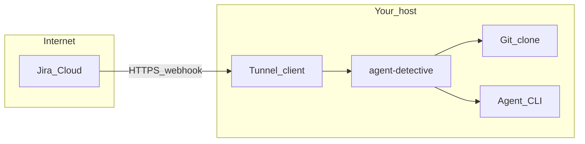

# Golden path — first analysis

Two milestones on the way to production:

| Milestone | Time | Jira account? | Guide |
|-----------|------|---------------|--------|
| **Local mock smoke** | ~5 min | No | [Get started](get-started.md) |
| **Real Jira webhook** | ~15 min | Yes | This page |

Complete **get started** first (`agent-detective smoke` → `[MOCK] Added comment` in logs). Then wire Jira through a tunnel.

## Target outcome (real Jira)

- **`agent-detective doctor`** passes — see [CLI reference — doctor](cli.md#doctor).
- Server answers **`GET /api/health`** on your port.
- A Jira (or Automation) webhook reaches your server through **HTTPS** (tunnel or reverse proxy).
- With **`mockMode: true`**, logs show **`[MOCK] Added comment`** after an issue with a **matching repo label**.
- With **`mockMode: false`**, a real comment appears on the issue (allow time for API credentials).

Deep detail: [jira-manual-e2e.md](../e2e/jira-manual-e2e.md).

## Prerequisites

| Requirement | Notes |
|-------------|--------|
| **Node.js 24+** | npm: `npm i -g agent-detective`. Contributors: pnpm 10+ — [development.md](../development/development.md). |
| **git** on `PATH` | local-repos plugin reads your checkout. |
| **Agent CLI** (OpenCode, Cursor, …) | Match `config.agent`; authenticated for real analysis. |
| **Git clone** on disk | `repos[].name` must match a Jira **label** (case-insensitive). |
| **Jira Cloud** | Webhooks or Automation → Send web request. |
| **Tunnel** (ngrok, Cloudflare Tunnel, …) | Jira needs **HTTPS** to your host. |

## Steps (real Jira)

1. **Install and scaffold** (if not done)

   ```bash
   npm i -g agent-detective
   mkdir -p ~/agent-detective && cd ~/agent-detective
   agent-detective init --yes --repo-path /absolute/path/to/checkout --repo-name my-app
   agent-detective doctor --config-root .
   ```

   Contributors from a git clone: `pnpm install`, copy `config/local.example.json` → `config/local.json`, `pnpm run dev`.

2. **Local smoke** (optional but recommended)

   ```bash
   agent-detective --config-root .   # terminal 1
   agent-detective smoke --config-root .   # terminal 2
   ```

3. **Run the server** (if not already)

   ```bash
   agent-detective --config-root .
   ```

4. **Tunnel** — expose `http://127.0.0.1:<port>` (default **3001**) as public **HTTPS**.

5. **Jira webhook**

   - URL: **`https://<tunnel-host>/plugins/agent-detective-jira-adapter/webhook/jira`**
   - Events: **Issue created**, **Comment created** (retry path).
   - Automation without `webhookEvent` in the body: add **`?webhookEvent=jira:issue_created`** — see [jira-manual-e2e.md](../e2e/jira-manual-e2e.md#which-webhook-source-are-you-using).

6. **Create a Jira issue** with a **label** equal to your repo `name`.

7. **Verify** — logs: webhook → queued → agent → comment (`[MOCK]` or real).

## Reference layout



Production **nginx** TLS: [deployment.md](deployment.md).

## Troubleshooting

| Symptom | What to check |
|---------|----------------|
| Webhook never hits server | Tunnel URL, Jira rule history, firewall, correct **POST** path under `/plugins/...`. |
| 400/404 on webhook | Plugin loaded (`doctor`, startup logs); path matches Jira adapter route. |
| No analysis | Issue **labels** match **`repos[].name`** — [matching docs](../e2e/jira-manual-e2e.md#matching-a-ticket-to-a-repository). |
| `suppressing auto-analysis … cooldown` | Normal echo guard; wait or use explicit retry comment. |
| Agent fails | Agent on `PATH`, LLM credentials, `config.agent` id. |
| Real comment fails | `mockMode: false` + `JIRA_*` env — [configuration.md](../config/configuration.md). |

## Next steps

- [CLI reference](cli.md) · [Deployment](deployment.md) · [Threat model](threat-model.md)
- **Linear:** [linear-manual-e2e.md](../e2e/linear-manual-e2e.md)
- **PR pipeline:** [jira-pr-pipeline-manual-e2e.md](../e2e/jira-pr-pipeline-manual-e2e.md)

Support matrix: root [README.md](../../README.md#support-matrix).
